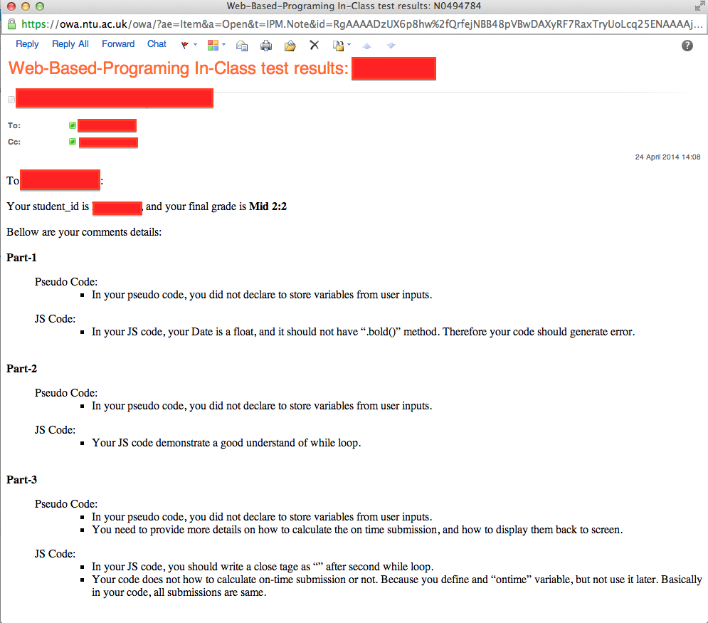

NTU_marking
===========
It aims to generate marking feedback to NTU students, and also be able to email out feedback to individual NTU students. The features includes:

1. **Easy editing**. you can put all marking and feedback into one MS word file (.docx). And let this program to take this word file and generate multiple format in different needs. 
2. **One file for all**. it can generate a file to include all students' feedback. You can set to include marking score in the file or not. So you would be able to validate your marking. Another reason to put all students into one file is becasue it is easyer to print out the hard copy. 
3. **Each student can have his own file**.it can also generate one file for eahch students, It would nice to include the file in email, or copy single to each students. 
4. **All score in a excel file**. It would also put all scores into a excel file, so it would be able to do simple stastic or send score out in excel. 
5. **Nice format and email out**. The email has been put into a HTML format. It is also easy to customise the format when send out. 
6. ** auto grade and score calculation **. 

## Install

1. install **python** make user you are using python 2.x not 3.x.
2. install **python-docx** so can read docx file type. **python-docs** can be found here: [https://python-docx.readthedocs.org/en/latest/user/install.html#install](https://python-docx.readthedocs.org/en/latest/user/install.html#install)

		pip install python-docx 
	
	
3. smtplib is a python internal lib, so no need to install seperately. 
4. check all the configureation
5. copy ** your marking file** into the folder. and adapt the file name in python code. 
6. run code

 		python ntu_student_marking.py

## CONFIG

###ntu_student_marking.py

in **ntu_student_marking.py** you can do following confuration, if you do not change, it would take the default value. 

1. **grade criteria**
2. **feedback file format**
3. **email template**
4. using **gmail** or **ntu email system** 

if you want to change feedback source format, make sure you change the **parse_student** function. 

###CONFIG.py

the **CONFIG.py** is used for email sending configuration. If you do not need to send email out, you can ignore this file. 
Otherwise, you have to change to change to your own details. This file will not be sync, so it is safe to keep locally. 
	

## screenshot

A complete example of files can be found in **/example** folder

